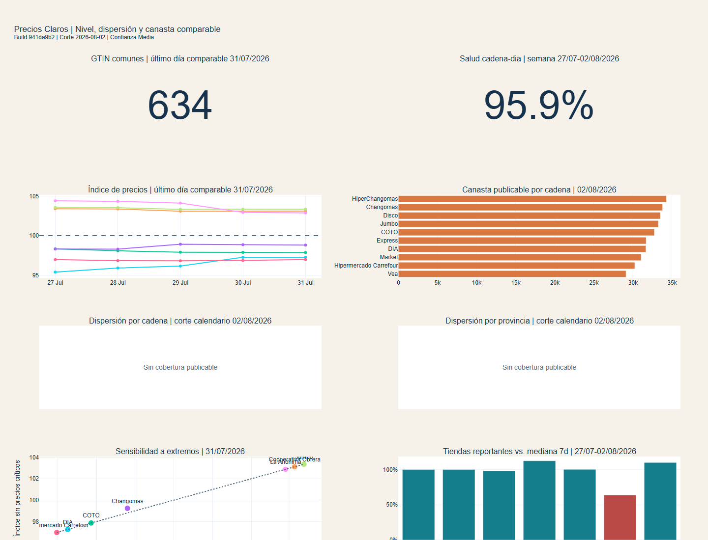
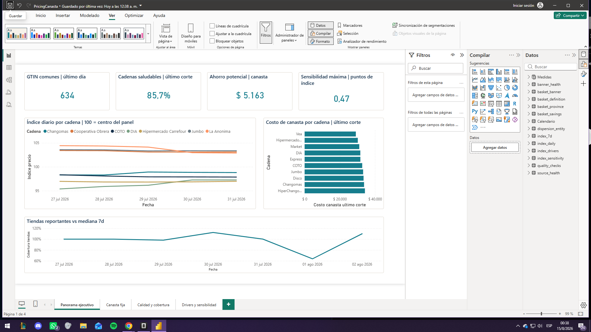
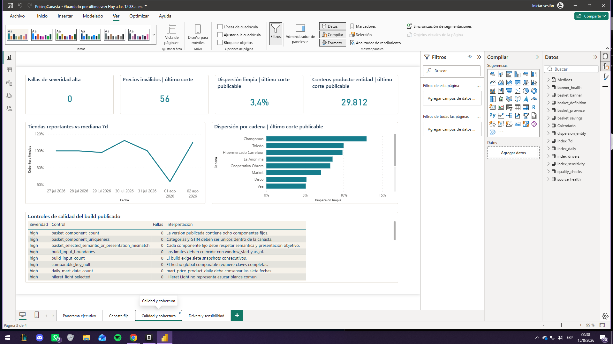

# Pricing y canasta de supermercado

[](https://github.com/alexanderhuth98/pricing-canasta-supermercado/actions/workflows/ci.yml)
[](https://alexanderhuth98.github.io/pricing-canasta-supermercado/)
[](LICENSE)

[English version](README_EN.md)

Caso de Data Analytics sobre 97,5 millones de precios publicados por **Precios Claros
- Base SEPA**. Compara cadenas con productos exactamente equivalentes, mide el costo de
una canasta fija y controla cobertura, outliers y calidad antes de publicar rankings.



## Impacto en 60 segundos

| Resultado | Hallazgo |
|---|---|
| Nivel de precios | Carrefour fue la cadena de menor índice en el último día comparable: `96,98`; Jumbo alcanzó `103,36`. |
| Consistencia semanal | DIA tuvo el menor índice medio de los cinco días publicables (`96,38`), seguida por Carrefour (`96,89`). |
| Ahorro de canasta | La mediana varió entre `$29.109` en Vea y `$34.272` en HiperChangomas: `$5.163` o `15,1%`. |
| Robustez | Excluir precios críticos modificó el índice como máximo `0,47` puntos. |
| Calidad | 94,6 millones de observaciones globales, cero duplicados del grano comparable y salud cadena-día de `95,9%`. |
| Dispersión publicable | El último corte con entidades publicables fue el `31/07`: dispersión limpia mediana de `3,4%` y `29.812` conteos producto-entidad cubiertos. |
| Limitación honesta | El `02/08` quedó totalmente `SUPPRESSED` para dispersión; no se fabricó un ranking con muestras insuficientes. |

**Corte:** 27 de julio al 2 de agosto de 2026. El último día comparable del índice es
el 31 de julio porque dos cadena-días no superaron el gate de cobertura.

## Preguntas de negocio

1. ¿Qué cadena presenta el menor nivel relativo de precios sobre el mismo panel de productos?
2. ¿La cadena más barata es consistente durante la semana?
3. ¿Cuánto puede ahorrar un consumidor eligiendo otra cadena para la misma canasta?
4. ¿Qué productos explican las diferencias del índice?
5. ¿Cuánto cambia el ranking cuando se excluyen precios extremos?
6. ¿Existe cobertura suficiente para comparar dispersión entre cadenas y provincias?

## Solución

- Descarga y versiona siete snapshots nacionales con SHA-256.
- Valida contratos CSV estrictos y carga 97.485.870 filas en DuckDB.
- Separa GTIN globales de códigos internos y restringidos `20-29`.
- Construye un índice geométrico de siete cadenas sobre GTIN comunes.
- Calcula una canasta de ocho GTIN sin promociones, sustituciones ni imputación.
- Detecta outliers transversales y saltos temporales.
- Publica resultados sólo cuando superan gates de salud y cobertura.
- Genera Excel, dashboard HTML desktop/móvil, CSV, Parquet y un proyecto Power BI reproducible.
- Entrega PBIP editable y PBIX validado con 14 tablas, 9 relaciones y 17 medidas.

## Metodología

### Índice

Cada cadena recibe igual peso y cada GTIN común recibe igual peso. Para cada producto se
calcula un benchmark geométrico entre cadenas; después se obtiene la media geométrica de
los precios relativos. Un valor 100 representa el centro del panel común.

### Canasta

Ocho GTIN fijos de aceite, arroz, azúcar, café, fideos, harina, leche y yerba. Sólo se
comparan sucursales con los ocho productos; los faltantes no se imputan.

### Calidad

El pipeline bloquea publicaciones con diferencias de filas, esquema incompatible,
duplicados, códigos locales en el hecho global, componentes inválidos o panel desigual.
Las advertencias de cobertura, geografía y outliers reducen la confianza sin ocultarse.

## Stack

`Python 3.11` · `DuckDB` · `SQL` · `pandas` · `Parquet` · `Plotly` · `Excel` · `Power BI`

## Arquitectura

```text
Catálogo oficial -> ZIP raw + hashes -> ingestión transaccional -> DuckDB
    -> 35 marts + quality gates -> build publicado
    -> CSV / Parquet / Excel / dashboard / Power BI
```

- Una ingestión fallida conserva el snapshot anterior.
- Un build fallido conserva todos los marts publicados.
- El linaje conecta hash raw, `ingest_run_id`, `build_id` y outputs.

## Explorar el proyecto

| Recurso | Contenido |
|---|---|
| [Dashboard web](https://alexanderhuth98.github.io/pricing-canasta-supermercado/) | Resultado ejecutivo desplegado con GitHub Pages. |
| [Dashboard móvil](https://alexanderhuth98.github.io/pricing-canasta-supermercado/mobile.html) | Layout responsive de una columna. |
| [EDA](docs/eda.md) | Distribuciones, cobertura, missing values, outliers y segmentos. |
| [SQL highlights](docs/sql_highlights.md) | Seis consultas representativas comentadas. |
| [Resumen ejecutivo](reports/2026-08-02/resumen_ejecutivo.md) | Hallazgos, acciones y limitaciones. |
| [Validación](reports/2026-08-02/validation_report.md) | Quality gates, linaje y confianza. |
| [Runbook técnico](docs/documentacion_tecnica_completa.md) | Tablas, lógica y recuperación ante fallas. |
| [Índice de documentación](docs/README.md) | Mapa de arquitectura, diccionario, EDA y runbook. |
| [Datasets de portfolio](portfolio_data/) | CSV agregados para revisión y Power BI. |
| [Proyecto Power BI](powerbi/PricingCanasta.pbip) | PBIP editable con modelo y reporte PBIR. |
| [Guía Power BI](powerbi/README.md) | Reconstrucción, medidas, validación y reglas de publicación. |
| [Guía de Releases](docs/releases.md) | Empaquetado, hashes y publicación de PBIX/XLSX/HTML offline. |

## Power BI

El reporte se construye desde los CSV agregados de `portfolio_data/`; nunca importa los
97,5 millones de registros de `fact_price`. Incluye cuatro páginas: panorama ejecutivo,
canasta fija, calidad y cobertura, y drivers/sensibilidad.





En dispersión, las tarjetas buscan la fecha máxima que contenga filas
`coverage_status = PUBLISHABLE`. Así muestran el último resultado defendible (`31/07`)
cuando el corte global más reciente (`02/08`) está completamente `SUPPRESSED`; los datos
suprimidos no se reemplazan por cero ni se incorporan a rankings.

La salud cadena-día de `95,9%` resume toda la semana (`47/49` cadenas-día). La tarjeta
Power BI de `85,7%` corresponde sólo al último corte disponible (`6/7` cadenas saludables).

## Ejecutar

La instalación recomendada usa el lockfile versionado:

```powershell
uv sync --extra dev --locked
uv run pytest -q
uv run pricing-canasta --help
```

Alternativa con `pip`:

```powershell
python -m venv .venv
.\.venv\Scripts\python.exe -m pip install -e ".[dev]"
.\.venv\Scripts\pricing-canasta.exe --help
```

Las pruebas y los agregados publicados son reproducibles desde un clon limpio. La
reconstrucción exacta del corte histórico requiere los siete ZIP originales cuyos SHA-256
figuran en `manifests/raw_sources.jsonl`; el catálogo oficial es rotativo y no garantiza
su disponibilidad histórica. Consulte [acceso a datos](docs/data_access.md).

## Publicación

- Git versiona código, SQL, tests, documentación, PBIP textual y CSV agregados curados.
- GitHub Pages publica `site/`, con Plotly cargado desde CDN.
- PBIX, XLSX y HTML autocontenidos se distribuyen como activos de GitHub Releases.
- Raw, DuckDB, Parquet, temporales y muestras detalladas permanecen fuera del historial.

## Verificación

- 60 pruebas automatizadas.
- Cobertura de código superior al 80%.
- Cero quality gates altos en el build publicado.
- 97.485.870 filas fuente reconciliadas sin pérdida.
- GitHub Actions y `.gitlab-ci.yml` ejecutan instalación bloqueada, Ruff, cobertura y
  auditoría de dependencias; GitHub añade enlaces, secretos y validación estática PBIP.

## Limitaciones

- Siete días describen el corte, pero no permiten estimar inflación o estacionalidad.
- Los precios son informados por comercios y pueden contener errores o paquetes faltantes.
- El índice no está ponderado por ventas ni consumo de hogares.
- El resultado nacional representa la red observada, no población.
- La dispersión del `02/08` quedó suprimida por cobertura insuficiente. Power BI muestra
  por separado el último corte publicable (`31/07`) y no lo presenta como dato del `02/08`.

## Fuente

- [Catálogo oficial de Precios Claros](https://datos.gob.ar/api/3/action/package_show?id=precios-claros-base-sepa)
- [Especificación técnica SEPA](https://datos.produccion.gob.ar/dataset/6f47ec76-d1ce-4e34-a7e1-621fe9b1d0b5/resource/ace44eb9-c995-463f-bf8a-6f529d196a27/download/anexo_6201340_2.pdf)

Licencia del proyecto: MIT. Licencia declarada por la fuente: CC BY 4.0.
